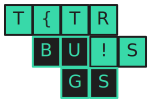

<p align="center">
  
</p>

# 👾 Tetris Bugs: The Code Editor You Never Asked For

Built by **Grand Gardenias** for Python Discord's Summer CodeJam 2025. Challenge theme: **Wrong Tool for the Job** using **Python in the Browser** via [Pyscript](https://pyscript.net/).

---

## 🎯 The Concept

Instead of typing code like a normal human, you now have to **catch falling code blocks** and arrange them into working programs.

## 🎮 Game Modes (Choose Your Suffering)

### 1. 🏗️ Tetris Code Editor

- New File
- Export/Save
- Undo/Redo
- Run Code
- Terminal Output
- Code Falls from Sky

### 2. ⚡ CodeRush Mode

- 5-minute timer counting down
- Questions show up on the left
- Solve as many as you can before time’s up
- Your score = how many problems you solved before the end

### 3. 🗡️ Roguelike Mode

- We provide the CORRECT solution
- Arrange the blocks properly to "clear" lines like Tetris
- Wrong arrangements stack up
- Reach the top = GAME OVER

### 4. We could not finish the multiplayer mode, but it is documented in [docs/goals.md](docs/goals.md)  

## 🛠️ Tech Stack

- **PyScript**
- **TailwindCSS**

## 📦 Requirements

- Python 3.13+
- Node.js & npm

## ⚙️ Setup Instructions

1. Clone the repository:
    ```shell
    git clone https://github.com/zishankadri/tetris-bugs.git
    cd tetris-bugs
    ```
3. Start a local Server:
    ```shell
    cd frontend
    npm install
    npm run build
    python -m http.server
    ```

3. **Open Your Browser** to `http://localhost:8000`
4. 💡 For Contributors: Run `npm run dev` to auto-update Tailwind while you code.

## 🎉 Achievement Unlocked
**Congratulations! You now have the most unique answer to "What IDE do you use?"**

*"Oh, I use Tetris."*

## Video Presentation
[code-editor.webm](https://github.com/user-attachments/assets/cf059496-4f29-4d98-a95a-8969f91b333e)

<details>
    <summary>🗡️ Roguelike Video Presentation </summary>

[roguelike.webm](https://github.com/user-attachments/assets/ffc35054-e3de-4e12-ac63-f1e3520f2ee8)
</details>


<details>
    <summary>⚡ CodeRush Video Presentation </summary>
    https://drive.google.com/file/d/1t6_92z2R_ntOok2yyzjklHpKyxoKZl_g/view
</details>

## 📸 Screenshots
<details>
    <summary>Preview Images 📸</summary>
    
    
    
    
    

</details>

## 🎯 Wrong Tool for the Job

✅ Using Tetris as an IDE  
✅ Spatial reasoning for coding problems  

## 🤝 Credits

(in order of contributed LOC):

<table>
  <tr>
    <th></th>
    <th>Name</th>
    <th>Contributions</th>
  </tr>
  <tr>
    <td><a href="https://github.com/zishankadri"></a></td>
    <td><a href="https://github.com/zishankadri">Luffy</a></td>
    <td>Lead developer, Project architecture, Ideation, Frontend</td>
  </tr>
  <tr>
    <td><a href="https://github.com/rxdiationx"></a></td>
    <td><a href="https://github.com/rxdiationx">rxdiationx</a></td>
    <td>Base of CodeRush, sound effects/music, loading screen, Sourcing of problems</td>
  </tr>
  <tr>
    <td><a href="https://github.com/Sapient44"></a></td>
    <td><a href="https://github.com/Sapient44">Sapient44</a></td>
    <td>Terminal and code execution, Modifications in roguelike mode, Sourcing of audio</td>
  </tr>
  <tr>
    <td><a href="https://github.com/Shivk123"></a></td>
    <td><a href="https://github.com/Shivk123">Shivk123</a></td>
    <td>Meeting facilitation, Initial file structure, Set up Flask backend</td>
  </tr>
  <tr>
    <td><a href="https://github.com/mhasanali2010"></a></td>
    <td><a href="https://github.com/mhasanali2010">mhasanali2010</a></td>
    <td>timer logic, pause screen</td>
  </tr>
</table>
