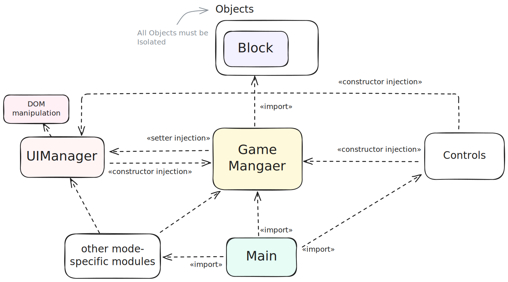

# Project Architecture

*(See  for visual reference.)*

**Goal:** Avoid circular imports, enable reuse across modes, separate concerns.

## Layers

1. **Objects Layer** — self-contained game entities (no external knowledge).  
2. **Core Game Management** — orchestrates state, no DOM access.  
3. **Support Modules** — UI Manager, controls, block generators.  

**Entry Point:** `main` wires components together and selects the mode.  

## Dependency Rules

- Objects → no outward dependencies.  
- Game Manager → can talk to objects & support modules, but no cycles.  
- UI Manager → DOM Manipulation.
- Controls → interact with Game Manager and objects only.  
- `main` → composition root, no logic.

Modes can add their own files, but they must follow the same rules.
