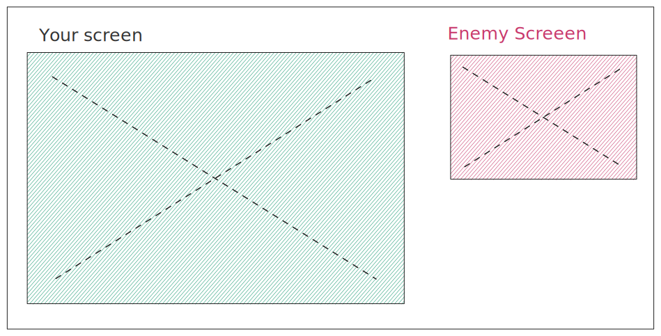
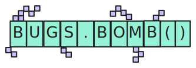
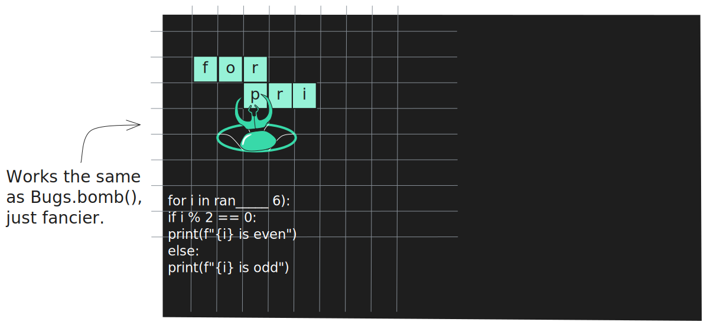

# MULTIPLAYER

## THE CONCEPT OF 👾 Bugs

Occasionally, instead of the actual code blocks, the player will receive bugs from a number of pre-defined weapons in a class named 'Bugs' e.g. Bugs.beetle(). I originally thought of Bugs.bomb (), which on placing will immediately disappear from the player's own screen, but a bomb will appear at the same spot on the enemy's screen touching which will require the enemy to do over that one block, giving us a 'time advantage'. This will make so much sense if we create a 'time-based winner' game. (Open to suggestions this is just an example I have in mind for now.)

## Bugs.beetle()  

